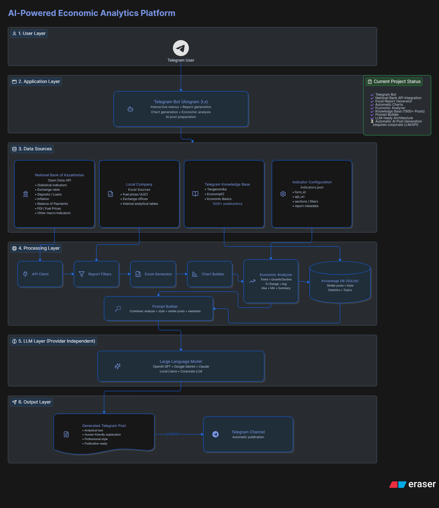
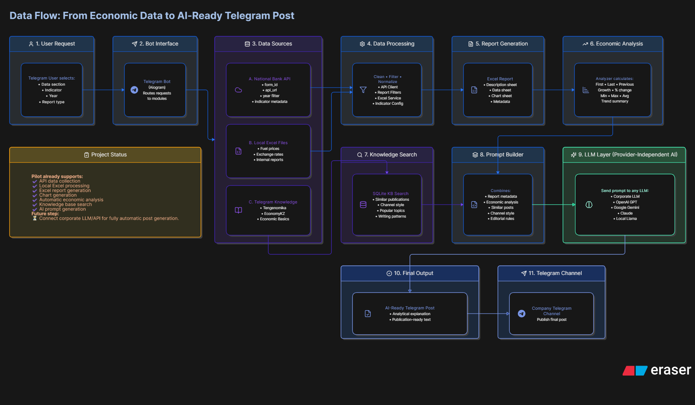

# 📊 EcoMind
### AI-Powered Economic Analytics Platform

> A modular Telegram platform for collecting, analyzing, visualizing, and preparing economic data for AI-generated publications.


---

## 📌 Overview

**EcoMind** is an AI-ready economic analytics platform developed during an industrial internship.

The system retrieves economic indicators from the **National Bank of Kazakhstan**, collects exchange rates and fuel prices from external financial sources, processes the data, generates Excel reports with charts, and prepares structured prompts for future AI-generated Telegram publications.

---

## ✨ Features

- 📈 National Bank of Kazakhstan Open Data API integration
- 💱 Exchange rates monitoring from Kurs.kz
- ⛽ Fuel price monitoring from OilClub.kz
- 📊 Automatic Excel report generation
- 📉 Automatic chart generation
- ⚡ Five-minute caching
- 🔍 Indicator filtering
- 📚 Knowledge base integration
- 🧠 Economic trend analysis
- 🤖 AI prompt generation
- 📨 Telegram Bot interface

---

## 🏗 System Architecture



The platform is organized into independent layers: user interface, bot logic, data sources, processing modules, knowledge search, LLM layer, and output delivery.

---

## 🔄 Data Flow



The data pipeline follows the full path from user request to report generation and AI-ready publication text.

---

## 🏛 Project Architecture

```text
EcoMind
│
├── Telegram Bot (Aiogram)
│
├── Services
│   ├── National Bank API
│   ├── Kurs.kz integration
│   ├── OilClub.kz integration
│   ├── Report filters
│   ├── Economic analyzer
│   ├── Prompt builder
│   ├── Knowledge search
│   ├── Excel generator
│   └── Chart generator
│
├── Knowledge Base
├── Reports
└── Configuration
```

---

## 📂 Repository Structure

```text
services/
├── api_client.py
├── azs_web_service.py
├── fx_web_service.py
├── excel_generator.py
├── graph_generator.py
├── report_filters.py
├── economic_analyzer.py
├── prompt_builder.py
└── knowledge_search.py

analysis/
knowledge/
models/
data/

main.py
config.py
```

---

## ⚙️ Technologies

- Python 3.11
- Aiogram 3.x
- Pandas
- OpenPyXL
- Requests
- BeautifulSoup
- JSON API
- Web scraping
- SQLite knowledge base

---

## 📡 Data Sources

| Source | Purpose |
|---|---|
| National Bank of Kazakhstan API | Economic indicators |
| Kurs.kz | Exchange rates |
| OilClub.kz | Fuel prices |
| Internal Knowledge Base | AI prompt generation |

---

## 📊 Generated Reports

EcoMind automatically generates:

- Excel reports
- Charts
- Filtered datasets
- Metadata sheets
- Economic summaries
- AI-ready prompt structures

---

## 🧠 AI Pipeline

The project is designed for future integration with provider-independent LLMs:

- OpenAI GPT
- Google Gemini
- Claude
- Local Llama
- Corporate LLM

The generated prompt can include economic analysis, trend calculations, similar historical publications, writing style examples, and report metadata.

---

## 🚀 Current Status

| Module | Status |
|---|---|
| Telegram Bot | ✅ Completed |
| National Bank API integration | ✅ Completed |
| Kurs.kz integration | ✅ Completed |
| OilClub.kz integration | ✅ Completed |
| Excel report generation | ✅ Completed |
| Chart generation | ✅ Completed |
| Economic analysis | ✅ Completed |
| Knowledge base search | ✅ Completed |
| AI prompt generation | ✅ Completed |
| Automatic Telegram publication | ⏳ Planned |
| Corporate LLM integration | ⏳ Planned |

---

## 💡 Future Improvements

- Scheduled report generation
- PostgreSQL storage
- Airflow automation
- Interactive dashboards
- REST API
- Docker deployment
- CI/CD pipeline
- Vector database for semantic search
- Automatic Telegram publishing

---

## 👨‍💻 Author

**Daulet Kazmukhambetov**  
Software Engineering Student  
Astana IT University  
Industrial Practice Project
